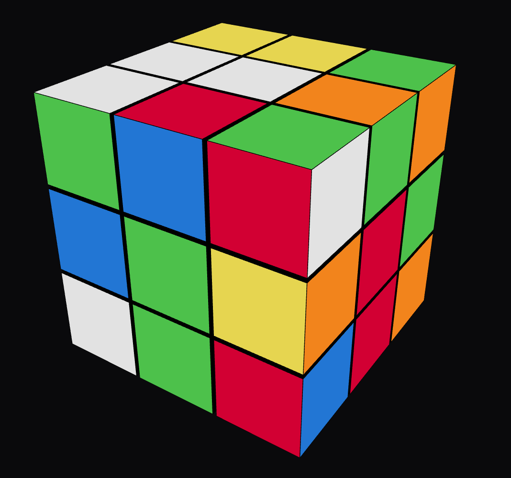

# 🧊 Rubik's Cube Solver App

A fully interactive 3D Rubik's Cube web application built with React and Three.js. This application allows you to play with a 3D Rubik's Cube, shuffle it, input standard algebraic notation, and automatically solve it using Kociemba's two-phase algorithm.

## 📸 App Preview



## ✨ Features

- **Interactive 3D Visualization**: Smooth, perfectly synchronized 3D animations using `@react-three/fiber` and `@react-three/drei`.
- **Intelligent Solver**: Automatically calculates the shortest path to solve any valid cube state.
- **Step-by-Step Playback**: Step forward, backward, or play the entire solution sequence automatically.
- **Algebraic Notation Support**: Input standard cube notation (e.g., `R U R' U'`) to manipulate the cube manually.
- **State Import/Export**: Instantly copy or import the 54-character Kociemba state string to share layouts or save your progress.
- **Random Shuffle**: Generate a random 20-move shuffle with the click of a button and easily copy the generated sequence.
- **Sleek UI**: A modern, glassmorphic user interface layered over the 3D canvas.

## 🛠️ Technologies

- **React 18**
- **Vite**
- **Three.js** (@react-three/fiber, @react-three/drei)
- **Cube.js** (Internal logic and Kociemba solver)
- **Lucide React** (Icons)

## 🚀 Getting Started

### Prerequisites
Make sure you have [Node.js](https://nodejs.org/) installed on your machine.

### Installation

1. Clone the repository:
   ```bash
   git clone https://github.com/wadigzon/rubik-solver-app.git
   ```
2. Navigate to the project directory:
   ```bash
   cd rubik-solver-app
   ```
3. Install dependencies:
   ```bash
   npm install
   ```

### Running Locally

Start the Vite development server:
```bash
npm run dev
```
Open your browser and visit `http://localhost:5173`.

## 🎮 How to Use
- **Drag to Rotate**: Click and drag outside the cube to rotate the camera around the 3D scene.
- **Controls**: Use the **Shuffle** button to mix the cube up, or the **Solve** button to calculate a solution.
- **Standard Notation**: Type standard cube moves into the text box and hit Apply (e.g. `F2 B2 R2 L2 U2 D2` for a checkerboard pattern).
- **Importing Strings**: Paste a valid 54-character string (representing the 6 faces) into the state box and click **Import** to snap the cube to that exact configuration.

## 📝 License
This project is open-source and available under the MIT License.
